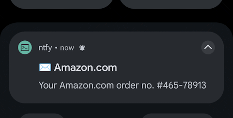

This script connects to an IMAP server and sends a ntfy.sh for each new email.

Usage  :

    imap-ntfy.sh user@domain.com password server:993 ntfy.sh/topic_name

You want it each time your server starts ?

Add to crontab

    @reboot /root/imap-ntfy.sh email@email.com xxxxxxxxxxx imap.domain.com:993 ntfy.sh/something

